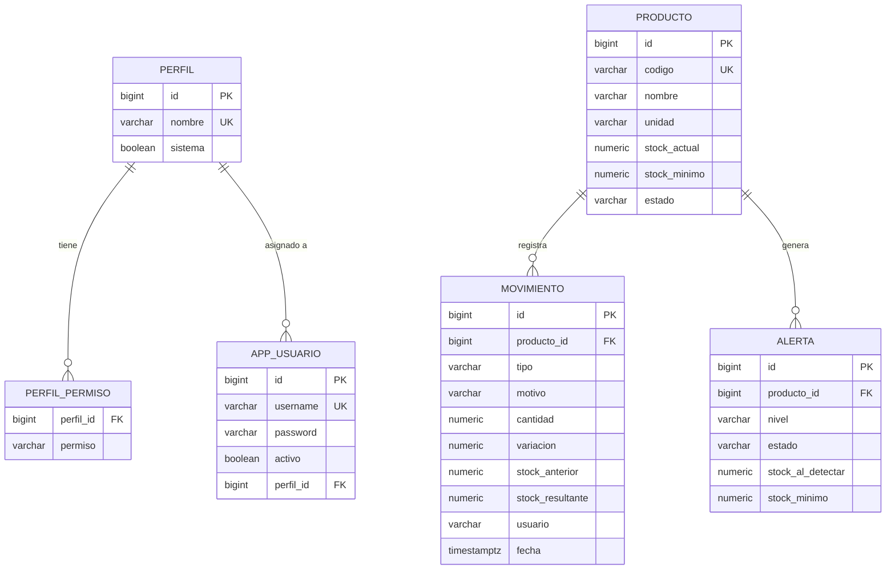
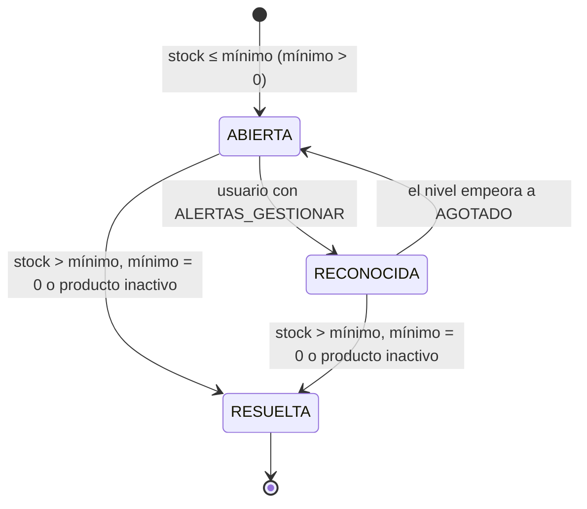
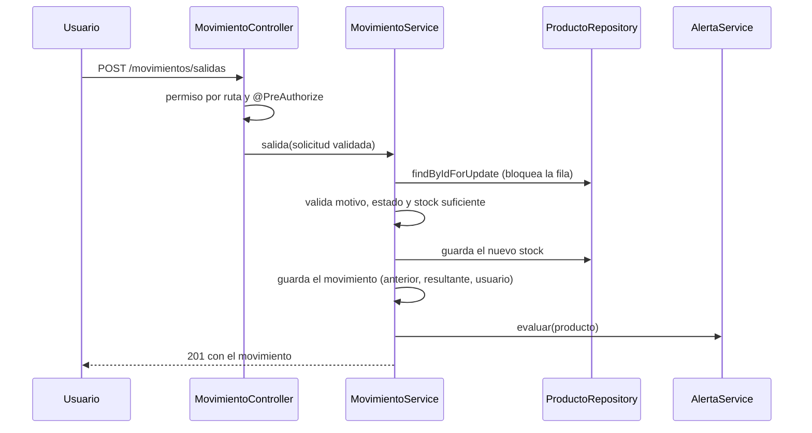

# Diseño técnico del módulo de inventario

Complementa [requisitos-inventario.md](requisitos-inventario.md). Describe el modelo de datos, las decisiones clave y cómo se verifica cada una.

## 1. Arquitectura

Aplicación Spring Boot en capas por módulo: `producto`, `inventario` (movimientos), `alerta`, `security` (usuarios, perfiles, cuenta), `reporte`, `error` y `config`. Cada módulo tiene controlador (HTTP y permisos), servicio (reglas y transacciones), repositorio (JPA) y DTO. El front-end React consume la API JSON y decide qué mostrar según los permisos de la sesión; el servidor los exige de todos modos.

## 2. Modelo de datos

Restricciones en la base: `stock_actual >= 0`, `stock_minimo >= 0`, `cantidad > 0`, `stock_resultante >= 0`, valores válidos de estado, tipo y nivel, claves únicas de código, usuario y nombre de perfil. El script completo es [db/init.sql](../db/init.sql).

## 3. Decisiones de diseño y su verificación

| Decisión | Motivo | Verificación |
|---|---|---|
| Bloqueo pesimista de la fila del producto (`SELECT … FOR UPDATE`) en cada movimiento | Dos salidas simultáneas no pueden dejar stock negativo ni perder una actualización | CA-25 (12 hilos sobre 5 unidades: exactamente 5 salidas) |
| `@DynamicUpdate` en `Producto` y el servicio nunca asigna el stock al editar | Una edición del producto no pisa un stock cambiado en paralelo | CA-18 |
| Movimientos sin setters ni endpoints de edición o borrado | Trazabilidad: se corrige con un ajuste, nunca reescribiendo | CA-28 |
| Una sola alerta vigente por producto, evaluada tras cada cambio de stock, mínimo o estado | Sin duplicados ni alertas obsoletas | CA-31 a CA-37 |
| Permisos releídos de la base en cada petición (el JWT solo identifica) | Desactivar un usuario o editar un perfil rige al instante | CA-48, CA-52 |
| Permiso exigido por ruta y por método | Sin permiso se responde 403 antes de validar el cuerpo | CA-51 |
| Guardián de «último administrador» dentro de la transacción | Nunca se pierde la capacidad de administrar usuarios y perfiles | CA-46 |
| Perfil de sistema inmutable; un usuario no puede desactivarse ni cambiarse el perfil a sí mismo | Evita bloquear la administración por error | CA-44, CA-49 |
| Cantidades `NUMERIC(14,3)`; nunca coma flotante en el servidor | Exactitud con metros, kilos y litros | CA-21, CA-26 |
| Migración idempotente previa a Hibernate (`migracion-previa.sql`) más `MigracionDatos` | Actualizar la base ya desplegada sin perder productos | CA-57 |
| CSV con BOM y neutralización de fórmulas | Excel abre bien las tildes y no ejecuta contenido malicioso | CA-41 |

## 4. Ciclo de vida de una alerta

## 5. Registro de un movimiento

## 6. Interfaz

- Cabecera con navegación según permisos, campana de alertas (se actualiza cada minuto y tras cada cambio de stock), idioma y tema.
- Pantallas: Panel, Productos, Movimientos, Alertas, Usuarios, Perfiles y Mi cuenta. Cada una funciona como tabla en escritorio y como tarjetas en móvil.
- Los formularios usan Formik y Yup con las mismas reglas que el servidor; los errores de la API se muestran en el mismo formulario.
- Un diálogo se reinicia al cerrarse para no conservar datos de la apertura anterior (defecto detectado por las pruebas E2E y corregido).
- Accesibilidad: enlace de salto, `nav` con nombre, etiquetas en todos los campos y botones de icono, `aria-current`, foco visible y avisos con `role="status"`.

## 7. Seguridad

Contraseñas con BCrypt; política de 8 a 72 caracteres con letra y número, sin espacios; CORS por variable de entorno; errores sin detalles internos; el reporte CSV neutraliza fórmulas; los datos de sesión viven en `sessionStorage`. No hay bloqueo por intentos fallidos ni autenticación de dos factores (fuera de alcance).
